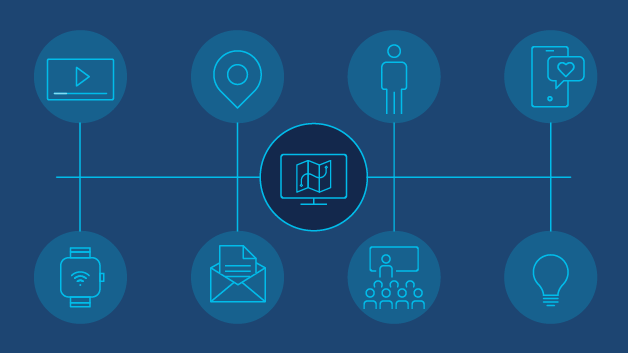

# User Analysis App

## Overview

The User Analysis App is a Streamlit web application that allows users to perform an analysis on user data. Users can upload data files, select specific dates, locations, and SSIDs to see the distinct count of User Names for each combination of the selected values. The results from two files can be merged for combined analysis. It provides an easy and intuitive way to visualize user activity based on the selected filters.

## Features

- Upload data files in CSV or Excel format.
- Interactive data selection widgets for Dates, Location Names, and SSIDs.
- Dynamic results display as tables and interactive line charts.
- Option to merge results from two uploaded files.
- Downloadable results in CSV, Excel, or PDF format.
- Clear all selections and reset the app for a fresh start.

## How to use

1. Navigate to the Streamlit app URL.
2. Upload your first and second Excel or CSV files using the upload widgets in the sidebar.
3. Select the desired filters for analysis.
5. Click 'Download Results' to download the results in a desired format.
6. Use the 'Reset' button to reset all selections and start a new analysis.

## Requirements

This app requires the following Python libraries:

- Streamlit
- Pandas
- Altair
- Openpyxl
- XlsxWriter

## Deployment

This app is deployed on Streamlit Cloud. For local deployment

